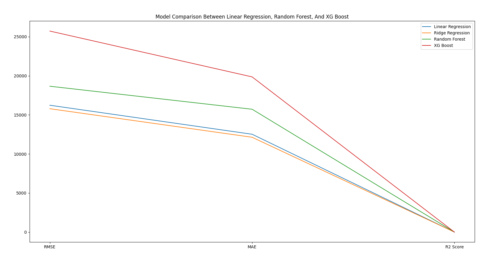

[Table of content:](#description)
- [Used Technologies](#used-technologies)
- [Details](#evaluation-metrics)
- [Commands](#to-run)
- [Result Examples](#result-examples)

# RetailPredict
RetailPredict is a sales forecasting application providing 4 machine learning algorithms to predict future sales based on historical data and compare their performances.

The project aims to forecast the number of items sold for a successive month based on the sales data of the previous 12 months,  additionally it is also provides insights into the monthly sales differences to assist businesses in anticipating demand,
optimizing resource allocation, and making informed decisions. It utilizes machine learning models, including Linear Regression, Ridge Regression, Random Forest Regression,
XGBoost Regression to predict future sales accurately.

# Used technologies:

* Python (3.10.12)
* PyYAML (6.0.1)
* autopep8 (2.0.4)
* numpy (1.26.4)
* pandas (2.2.1)
* xgboost (2.0.3)
* scikit-learn (1.4.1.post1)
* matplotlib (3.8.3)

### Evaluation Metrics:

The performance of the trained models is evaluated using Root Mean Squared Error (RMSE), Mean Absolute Error (MAE), and R2 Score metrics, which provide insights into the accuracy and effectiveness of the predictions.

### Dataset Description:

The project utilizes a Store Item Demand Forecasting Data, comprising approximately 913,000 entries without any NULL values. Each entry includes information such as the date of sale, store ID, item ID, and the number of items sold at a particular store on a specific date.

### Training and Testing Process:

The machine learning models are trained using the sales data of the previous 12 months. Subsequently, the trained models are tested to predict the number of items sold for the successive month. The performance of each model is assessed based on its ability to accurately forecast future sales.

---
## To run
1. Navigate into the Predictor directory </br></br>
2. Create virtual environment & activate </br></br>
3. Install the requirements </br></br>

```commandline
 pip install -r requirements.txt
```

### Commands to predict sales:
* **With Linear Regression:**
```commandline
python sales_predict.py 
```
```commandline
python sales_predict.py linear 
```
---
* **With Ridge Regression:**
```commandline
python sales_predict.py ridge 
```
---
* **With Random Forest:**
```commandline
python sales_predict.py forest 
```
---
* **With XG Boost:**
```commandline
python sales_predict.py xgb 
```
---
### Command for performance comparison
```commandline
python model_compare.py 
```
# Result examples
## Forecast :


## Performance evaluation example:

